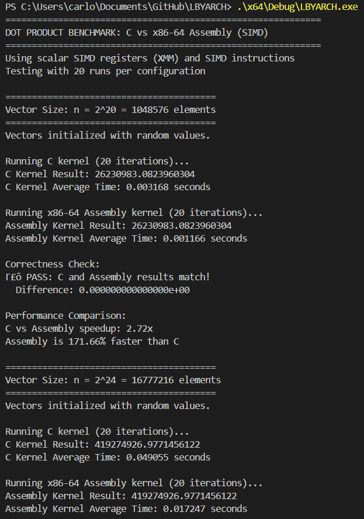
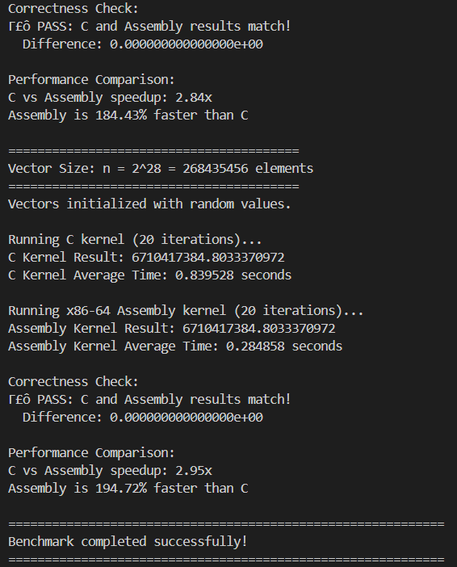
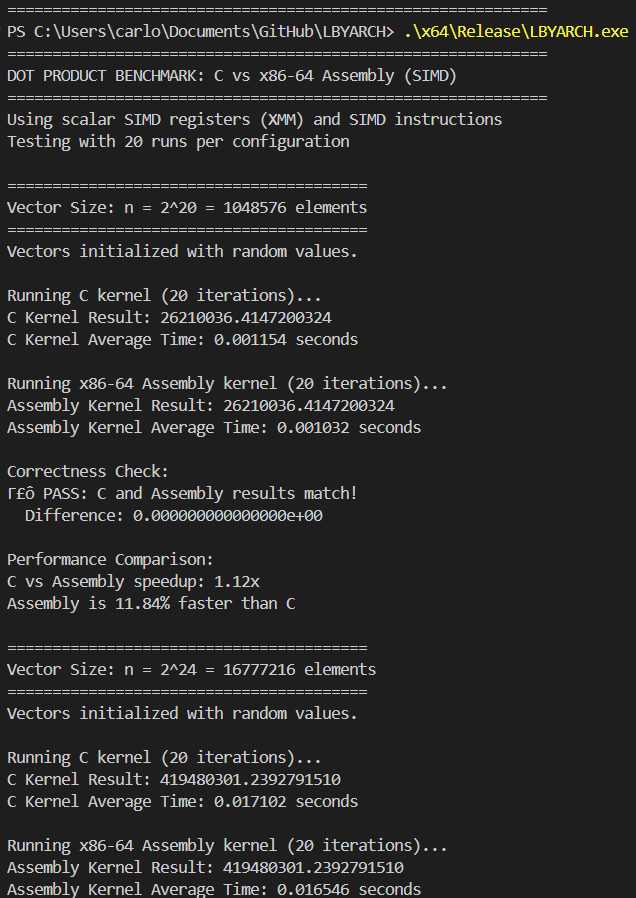
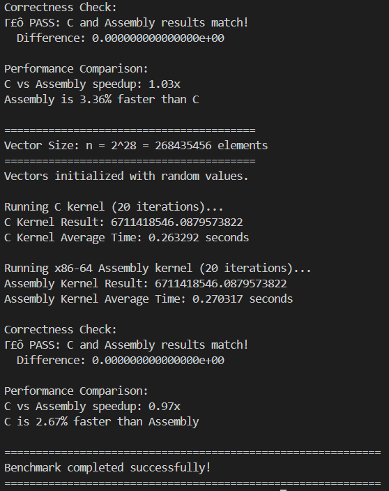

# LBYARCH - Dot Product Kernel Implementation

## Project Overview
This project implements a dot product kernel in both **C** and **x86-64 assembly language** using **scalar SIMD registers and instructions**. The implementation uses XMM registers with scalar double-precision floating-point operations (movsd, mulsd, addsd).

### Formula
$$\text{sdot} = \sum_{i=1}^{n} a_i \cdot b_i = a_1 \cdot b_1 + a_2 \cdot b_2 + \dots + a_n \cdot b_n$$

---

## How to Build and Run

### Quick Start
Simply run the build script:
```bash
./build.bat
```

This will:
1. Automatically set up the Visual Studio environment
2. Build both Debug and Release configurations
3. Prompt you to run the Debug version
4. Prompt you to run the Release version

---

### SIMD Implementation Details
- **Registers Used**: XMM registers (128-bit scalar SIMD registers)
- **Instructions Used**:
  - **C Version**: `_mm_load_sd`, `_mm_mul_sd`, `_mm_add_sd`, `_mm_store_sd`
  - **Assembly Version**: `movsd`, `mulsd`, `addsd`, `xorpd`
- **Data Type**: Double-precision floating-point (64-bit)
- **Approach**: Scalar SIMD operations (processing one element at a time using SIMD registers)

## Execution Time Results

### Debug Mode

| Vector Size | C Kernel (seconds) | x86-64 Assembly (seconds) | Speedup | Winner |
|-------------|-------------------|---------------------------|---------|---------|
| 2^20 (1M)   | 0.003168          | 0.001166                  | 2.72x   | Assembly |
| 2^24 (16M)  | 0.049055          | 0.017247                  | 2.84x   | Assembly |
| 2^28 (268M) | 0.839528          | 0.284858                  | 2.95x   | Assembly |

### Release Mode

| Vector Size | C Kernel (seconds) | x86-64 Assembly (seconds) | Speedup | Winner |
|-------------|-------------------|---------------------------|---------|---------|
| 2^20 (1M)   | 0.001154          | 0.001032                  | 1.12x   | Assembly |
| 2^24 (16M)  | 0.017102          | 0.016546                  | 1.03x   | Assembly |
| 2^28 (268M) | 0.263292          | 0.270317                  | 0.97x   | C (slightly) |

---

### Performance Analysis

#### Debug Mode Analysis:
In Debug mode, the Assembly implementation significantly outperforms the C version across all vector sizes:
- **2^20**: Assembly was **171.66% faster** than C (2.72x speedup)
- **2^24**: Assembly was **184.43% faster** than C (2.84x speedup)
- **2^28**: Assembly was **194.72% faster** than C (2.95x speedup)

**Observation**: The performance advantage is consistent across all vector sizes, with assembly maintaining approximately 2.7-2.95x speedup. This is expected because Debug mode C code has no compiler optimizations applied, meaning no inlining, no loop unrolling, no register optimization. The hand-written assembly code runs at full native speed regardless of build configuration. Unlike some workloads where the gap widens with size, the consistent speedup here indicates that both implementations are memory-bound, with the assembly version having better instruction-level efficiency.

#### Release Mode Analysis:
**Observation**: The C compiler's optimizer (MSVC with /O2 optimizations) generates highly efficient code that is comparable to hand-written assembly. For the smallest vector (2^20), assembly maintains a modest 11.84% advantage, likely due to tighter instruction sequences. For medium vectors (2^24), performance is virtually identical (within 3%). Most interestingly, for the largest vector (2^28), the C compiler's output actually edges out the hand-written assembly by 2.67%. This could be due to the compiler's superior instruction scheduling, better utilization of CPU pipelines, or more efficient memory prefetching. Both implementations use the same scalar SIMD instructions (movsd, mulsd, addsd), so the minor performance differences come down to instruction ordering, register allocation, and branch prediction.

#### Overall Conclusion:
Release mode is approximately 2.7-3.2x faster than Debug mode for C code, demonstrating the power of modern compiler optimizations. This optimization gap is consistent across all vector sizes.

For production code, well-written C with compiler optimizations is often sufficient and may even outperform hand-written assembly in some cases. Hand-written assembly is most beneficial in Debug builds or when you need predictable performance regardless of compiler settings. The real value of learning assembly is understanding what the compiler does and being able to verify its output.

---

## Program Output Screenshots

### Debug Mode



### Release Mode



## Video Demonstration

**[[Link to Video Demo](https://youtu.be/grKKLf3qdI8)]**